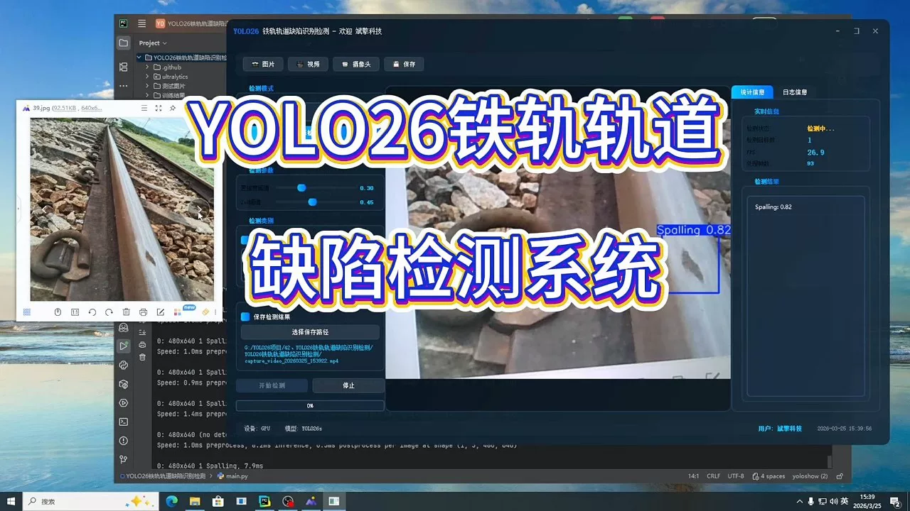
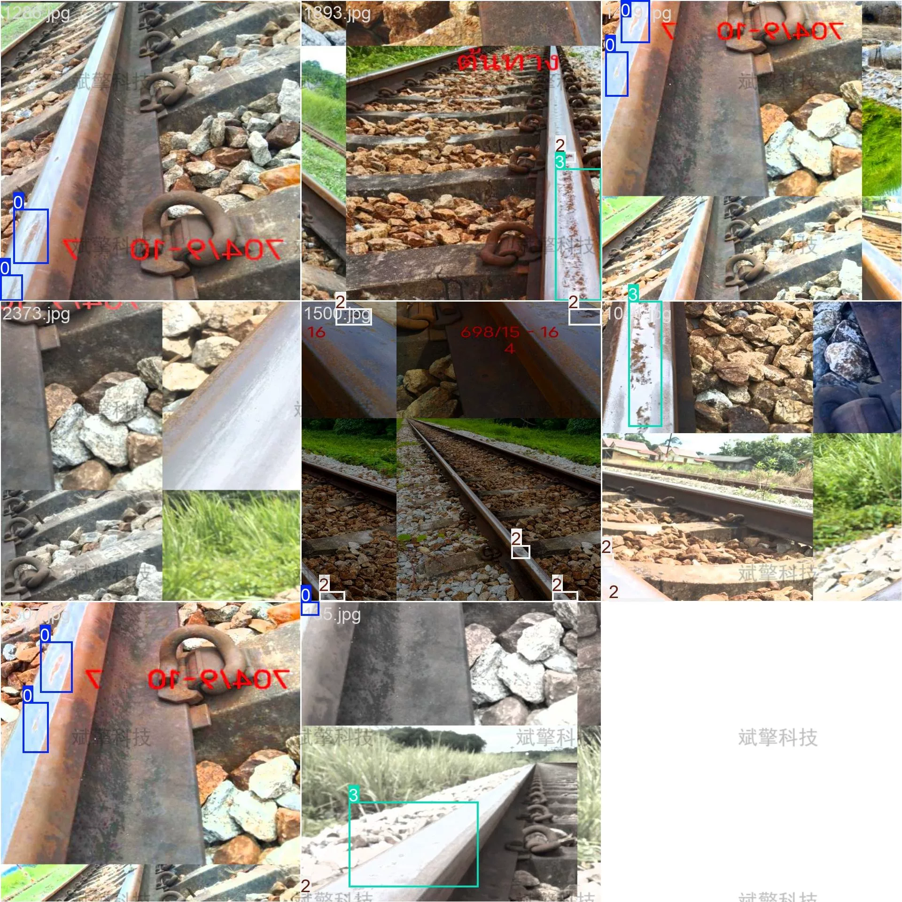
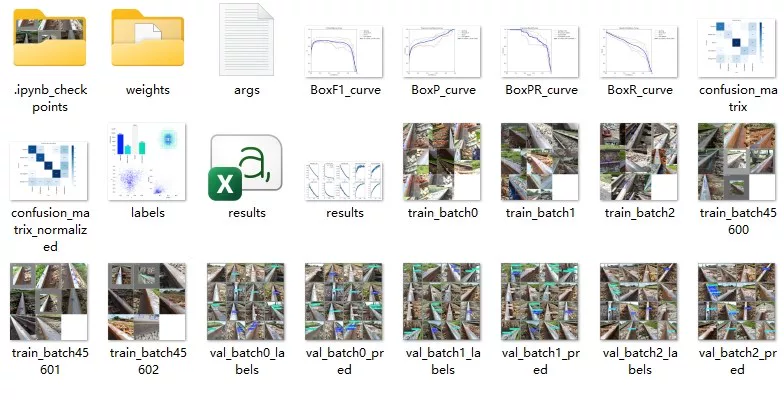
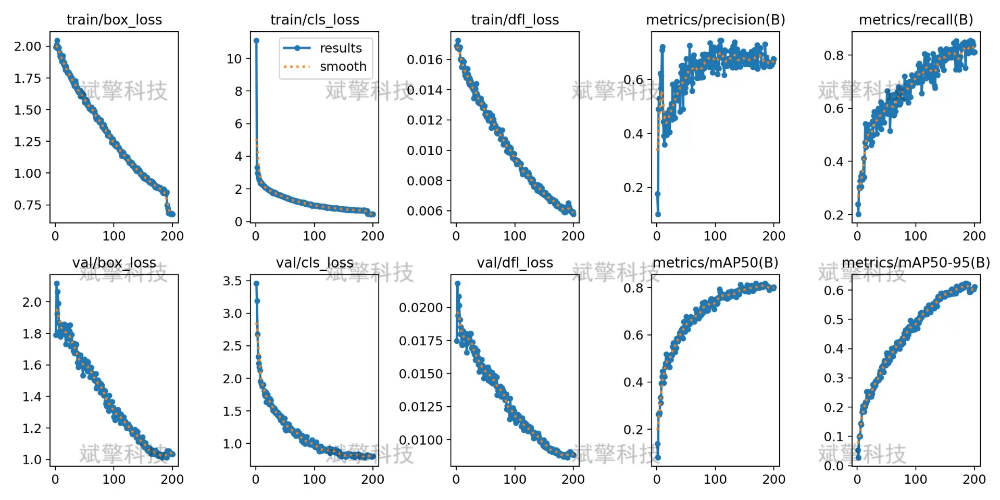
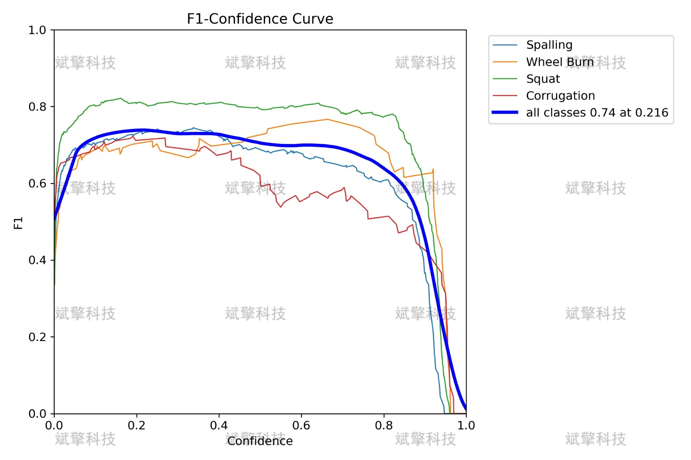
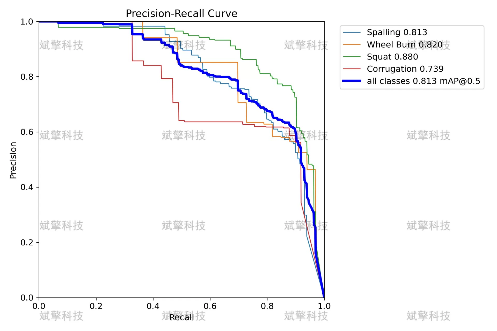
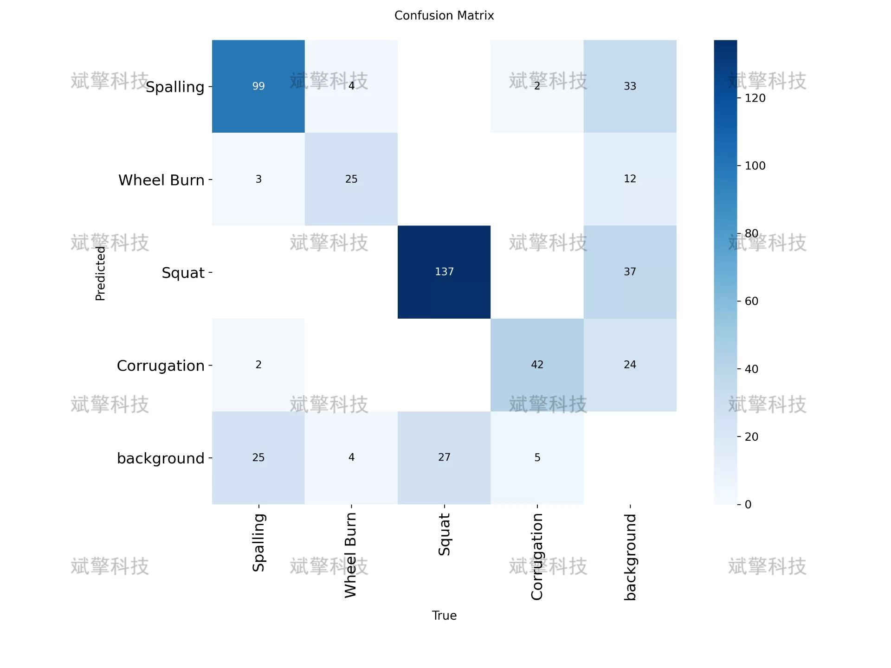
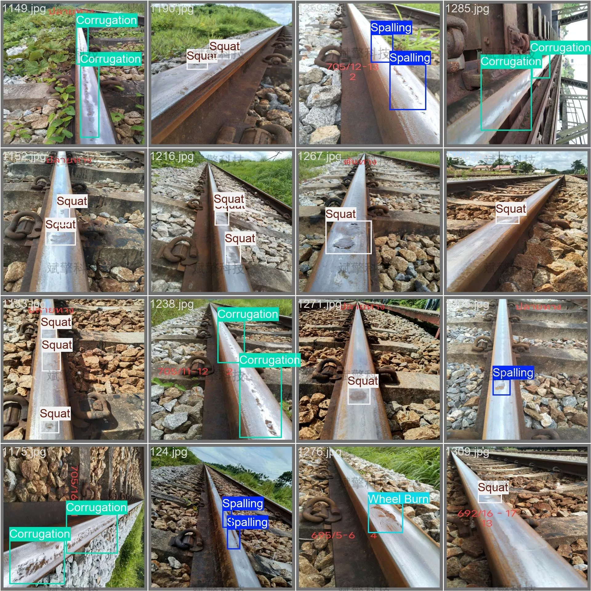
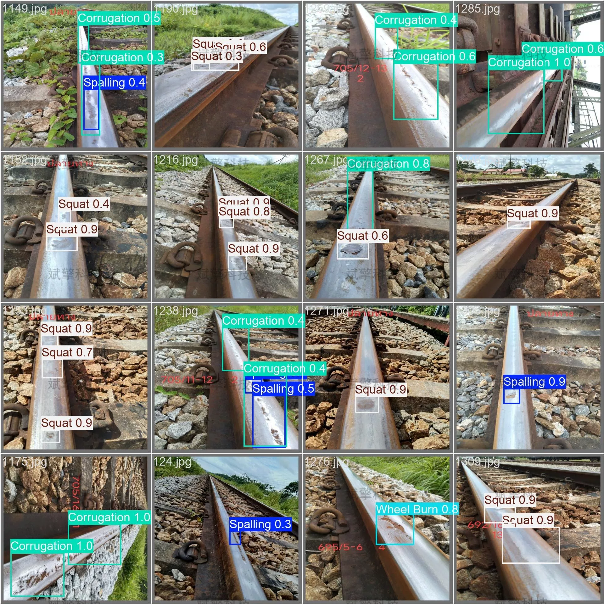

# YOLO26 Railway Track Defect Detection System | Source Code

## Body

YOLO26 Railway Track Defect Detection System | Source Code Based on YOLO26 for Automated Identification and Classification of Railway Track Surface Defects (Project Source Code + Dataset + Model Weights + UI Interface + Python + Deep Learning + Remote Environment Deployment)

This study is based on the YOLO26 object detection algorithm, aiming to automate the identification and classification of railway track surface defects. The experimental data set includes four common types of rail defect types (Spalling, Wheel Burn, Squat, Corrugation), with a training set of 1916 images, validation set and test set each consisting of 240 images. Through training the YOLO model, the detection performance of various defects was systematically evaluated. The experimental results show that the model performs well in distinguishing background from defects, but there is room for improvement in different defect categories. Overall mAP50 reached 0.813, with the recognition effect of the Squat category being the best (AP=0.88). This study provides a basic model for the automated detection of railway track defects and points out directions for future improvements.

The distribution of samples in each category in the dataset is as follows:
Spalling (Scraping): 309 labeled instances
Wheel Burn (Track Burning): 380 labeled instances
Squat (Railway Bulge): 552 labeled instances
Corrugation (Wave-shaped Wear): 152 labeled instances
Training set: 1916 images
Validation set: 240 images
Test set: 240 images

Free reservation for remote installation. Unsuccessful full refund.
Purchase Enjoy the following resources (Baidu Drive automatically unlocked)
     YOLO Detection Project Complete Source Code
    ️ YOLO format Dataset
      Training code + UI interface code
      Trained model + results image
      Software installation package
    ️ Add WeChat reservation for remote installation (Automatic display of WeChat ID after purchase) - Unsuccessful full refund

⚙️ Core Functional Modules
Detection Capability
    Image Detection: Upon upload, return detection boxes + category information
    Video Detection: Supports video files, analyzes frames accurately
    Camera Real-Time Detection: Connects to USB camera, realizes dynamic monitoring
Interaction and Control
    Target Filtering: Choose one or more categories for detection
    Parameter Real-Time Adjustment: Adjustable confidence threshold & IoU threshold, flexible control accuracy
    Result Save: One-click save of images/videos/camera detection results
System and Data
    User Login and Registration: Support password strength check + Encrypted storage
    Log Recording: Auto record operation and error information (timestamped)

## Images

## Payment

Here is a pay link on Stripe ( https://buy.stripe.com/3cs8yP7sY87d0vu9AB ). Please contact me lonlonago@foxmail.com after funding $89, and I will send you a complete data files , thank you!

